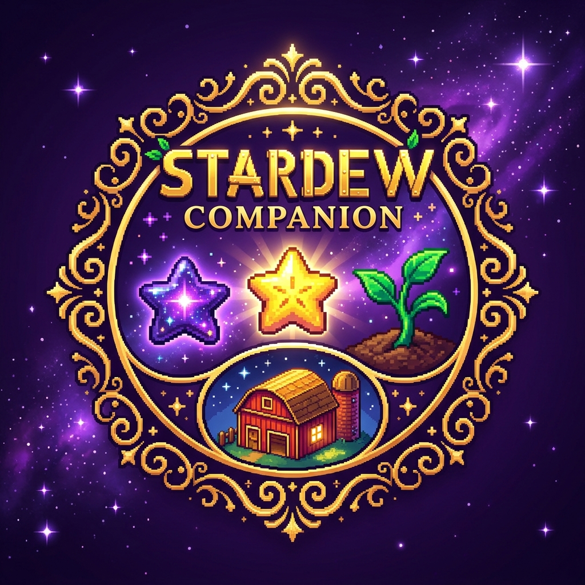

<div align="center">

# 🌟 Stardew Companion `v0.1.0`

### *De Jugadores para Jugadores — La Herramienta Definitiva para la Perfección y Organización en Stardew Valley*

[](https://flutter.dev)
[](https://github.com/Araxel19/Stardew-Companion/releases)
[](https://www.sqlite.org)
[](https://opensource.org/licenses/MIT)
[](https://nexusmods.com/stardewvalley)

<p align="center">
  
</p>

**Stardew Companion** es una aplicación multiplataforma (Windows Desktop, Android, iOS y Web) diseñada desde cero para granjeros exigentes que buscan alcanzar la **Perfección del 100%**, llevar la contabilidad financiera exacta de su granja, calcular rentabilidades de cultivos con fertilizantes/barriles y organizar eventos en un calendario de cosechas adaptativo.

</div>

---

## ✨ Características Principales

### 📂 1. Lector Nativo de Partidas Stardew Valley (`.xml`)
- Importación directa por Drag & Drop o explorador del archivo de guardado (`NegroLand_...` / `SaveGameInfo`).
- Análisis automático en cliente (100% privado y seguro).
- Extracción de datos del granjero, oro actual, nivel de habilidades, recetas cocinadas, objetos de fabricación, envíos (*Shipping*), colección de peces y amistades con aldeanos.
- **Detección Automática de Mods**: Reconocimiento inteligente de etiquetas de mods activos como *Ridgeside Village*, *Stardew Valley Expanded* (SVE), *SpaceCore*, etc.

### 🌾 2. Calculadora de Rentabilidad de Cultivos y ROI
- Selección por estación (Primavera, Verano, Otoño, Invernadero).
- Filtro por Fertilizantes (*Speed-Gro 10%*, *Deluxe Speed-Gro 15%*, *Hyper Speed-Gro 25%*).
- Toggles de Profesiones (*Agricultor +10% velocidad*, *Labrador +10% valor*, *Artesano +40% vino/conservas*).
- Comparativa de ROI por método de procesamiento: **Venta Directa**, **Jarras de Conservas**, **Barriles de Vino/Cerveza** y **Deshidratadores**.
- **Agendado Directo de Cosechas**: Exportación de días exactos de cosecha con un solo clic hacia el Calendario.

### 📅 3. Calendario Interactivo del Juego (28 Días Estacionales)
- Cuadrícula responsiva de 28 días por estación.
- Proyección visual de días de siembra y cosecha agendados.
- **Cumpleaños de Aldeanos** (Personajes Base + Mods como *Ridgeside Village* y *SVE*).
- **Festivales** y días del **Mercader Ambulante** (Viernes y Domingos).

### ⭐ 4. Seguimiento de la Perfección al 100% (*Qi's Challenge*)
- Indicador en tiempo real del % global de Perfección.
- Tarjetas de estado interactivas para Reloj de Oro (10,000,000g), 4 Obeliscos, Recetas de Cocina, Fabricación (Crafting), Peces Atrapados y Amistades.

### 💰 5. Contabilidad & Libro Mayor (SQLite Local)
- Registro de transacciones financieras (Ingresos / Gastos) persistente en SQLite.
- Categorización de movimientos (Semillas, Animales, Artesanías, Edificios, Herramientas, Minería).
- Gráficos interactivos de flujo de caja (`fl_chart`) y balance neto.

### 📦 6. Respaldos Multiplataforma (JSON Backup)
- Exportación e importación de copias de seguridad en formato `.json`.
- Permite transferir todos tus datos contables y tareas entre tu PC de escritorio y tu teléfono móvil.

### 🎨 7. Personalización Visual y Multilingüe
- **4 Temas Estacionales**: *Iridium Púrpura*, *Oro Solsticio*, *Primavera Esmeralda* e *Isla Coral*.
- **Multi-idioma**: Conmutación en tiempo real entre **Español 🇪🇸** e **Inglés 🇬🇧**.

---

## 📱 Responsividad y Plataformas

| Plataforma | Soporte | Notas |
| :--- | :---: | :--- |
| 🪟 **Windows Desktop** | `100% Nativo` | Ejecutable `.exe` acelerado por hardware con SQLite FFI |
| 🤖 **Android** | `100% Nativo` | Adaptación táctil con `BottomNavigationBar` y permisos de almacenamiento |
| 🍎 **iOS / macOS** | `100% Nativo` | Diseño responsivo para iPad y iPhone |
| 🌐 **Web** | `100% Nativo` | Ejecución ligera en navegador (Chrome / Edge / Safari) |

---

## 🛠️ Instalación y Compilación

### Requisitos Previos
- [Flutter SDK 3.24+](https://flutter.dev)
- [Dart SDK 3.5+](https://dart.dev)

### Pasos de Inicio Rápido

1. **Clonar el Repositorio**:
   ```bash
   git clone https://github.com/Araxel19/Stardew-Companion.git
   cd Stardew-Companion
   ```

2. **Instalar Dependencias**:
   ```bash
   flutter pub get
   ```

3. **Ejecutar en Navegador (Edge / Chrome)**:
   ```bash
   flutter run -d edge
   ```

4. **Ejecutar en Windows Desktop**:
   ```bash
   flutter run -d windows
   ```

5. **Compilar APK para Android**:
   ```bash
   flutter build apk --release
   ```

---

## 📜 Licencia

Este proyecto está bajo la Licencia **MIT** — consulta el archivo [LICENSE](LICENSE) para más detalles.

---

<div align="center">
  <sub>Desarrollado con ❤️ por <b>Araxel19</b> para la comunidad de Stardew Valley</sub>
</div>
